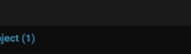
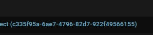
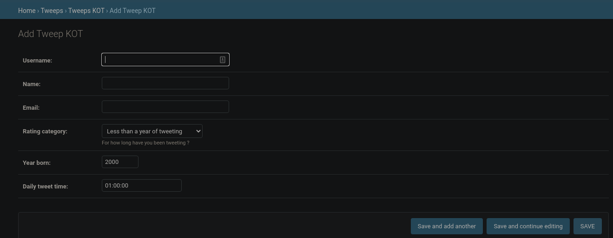

# admodels

# models.py file

The **Tweeps application**, is a simple application that helps select tweeps in categories, depending on how long you've been a *twitter user/tweeting*. This applicaction purely deals with the *models.py* file for data manipulation.

**Exploring Django new functionalities.**

Meta data and the Enum class for making choices easily and making the application fast.
Since Django 3.0, there is a Choices class that extends Python’s Enum types with extra constraints and functionality.

# UUID for making ids unique.

Universally unique identifier is a 128-bit number, usually represented as 32 hexadecimal characters separated by four hyphens. The probability that a UUID will be duplicated is not zero, but it is close enough to zero to be negligible.

**without UUID**

ID that Django uses out-of-the-box is incremented sequentially. That means that the 4th registered user has an id 4 and the 5th one has id 5. So, if I register and figure out that my id is 12, I know there were 11 people registered before me and I can try to get to their data by using their id. That makes your application very vulnerable.

**with UUID**

That's where UUID comes in handy. UUID key is randomly generated, so it doesn't carry any information as of how many people are registered to the page or what their id might be.

